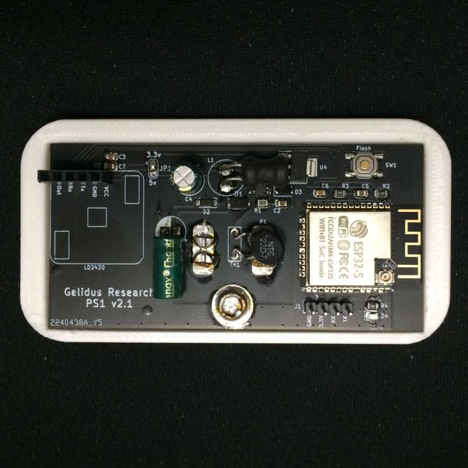

Gelidus Research PS1 Presence Sensor ESPHome component
=====================================================

The Gelidus Research PS1 mains powered human presence sensor integrates the new HLK-LD2420 24GHz mmWave radar module.
I addition to hosting the LD2420 the board will support the LD2410C by soldering JP1 at the 5v supply position. 




ESPHome Configuration
=====================

Hi-Link has changed several items in the process of this development.
Depending on the firmware you have the baudrate will be 256000 for any module with less than firmware v1.5.3
Also the tx_pin was moved from ot2 to ot1 with firmware v1.5.3 
Firmware v1.5.4 now features the ability to observe gate energy signal levels and with this release we can dynamically 
calibrate gate still and move thresholds. We have now refactored the previous external component with this capability.
We have added dynamic configuration functionallity with a compact UI format.
Select, number and button components provide configuration value inputs and control.

Select:
  Select will set the operational mode of the ld2420 component. Four modes are availble.
  Normal Mode:
    This is the default mode. It sets the ld2420 in energy reporting mode and is availble with firmware v1.5.4 or greater.
    When in this mode the module logs all gate energy levels continuouly in a local array making it available 
    for reporting and calibration functions.
  Calibration Mode:
    When selected the module will collect the average and peak energy levels, reporting them at a preset interval of 5sec.
    The report is provided in the log console and for information only. In order to calibrate the gate configurations no 
    objects should be present in the target environment. The recording will establish the mmWave noise floor levels and  
    undesirable reflections or signal distortions peaks. This should be collected for at least 30 seconds. Longer runs can 
    catch more potential false signals when devices near the module are used such as Microwave ovens and other signal 
    emiting sources.
    When the "Apply Config" button is triggered in calibration mode the ld2420 will be configured with calculated values 
    based on its collected noise floor data and the module will be returned to Normal Mode. Selecting any other mode drops
    the sessions collected noise data and no changes will occur. Once the "Apply Config" action is performed it will persist 
    and cannot be reverted. The gate values would need to be manually adjusted o calibrated again or you can do trigger a 
    factory reset.
  Simple Mode:
    Provides backward compatibility with firmware v1.5.3 and older and will be automatically set whne the firmware is less
    than v1.5.4.

Example of calibration reporting information:

```
[14:31:35][I][ld2420:258]: Gate:  0 Avg:  8656 Peak: 18020
[14:31:35][I][ld2420:258]: Gate:  1 Avg:  2304 Peak: 13968
[14:31:35][I][ld2420:258]: Gate:  2 Avg:    39 Peak:  3620
[14:31:35][I][ld2420:258]: Gate:  3 Avg:    18 Peak:    53
[14:31:35][I][ld2420:258]: Gate:  4 Avg:    16 Peak:    74
[14:31:35][I][ld2420:258]: Gate:  5 Avg:    15 Peak:    45
[14:31:35][I][ld2420:258]: Gate:  6 Avg:    17 Peak:    45
[14:31:35][I][ld2420:258]: Gate:  7 Avg:    75 Peak:   244
[14:31:35][I][ld2420:258]: Gate:  8 Avg:    65 Peak:   233
[14:31:35][I][ld2420:258]: Gate:  9 Avg:    13 Peak:    53
[14:31:35][I][ld2420:258]: Gate: 10 Avg:    12 Peak:    29
[14:31:35][I][ld2420:258]: Gate: 11 Avg:    12 Peak:    34
[14:31:35][I][ld2420:258]: Gate: 12 Avg:    13 Peak:    58
[14:31:35][I][ld2420:258]: Gate: 13 Avg:    13 Peak:    29
[14:31:35][I][ld2420:258]: Gate: 14 Avg:    24 Peak:    73
[14:31:35][I][ld2420:258]: Gate: 15 Avg:    36 Peak:    90
[14:31:35][I][ld2420:260]: Total samples: 251
```

```
external_components:
  - source: github://gelidusresearch/grps@current
    components: [ ld2420 ]
    refresh: 0s


esphome:
  name: presence-2
  friendly_name: presence-2

esp32:
  board: esp32dev
  framework:
    type: arduino

# Enable logging
logger:
  level: DEBUG
  

# Enable Home Assistant API
api:
  encryption:
    key: "<your key>"

ota:
  password: "<your password>"

wifi:
  ssid: !secret wifi_ssid
  password: !secret wifi_password

  # Enable fallback hotspot (captive portal) in case wifi connection fails
  ap:
    ssid: "presence-2"
    password: ""

captive_portal:

web_server:
  port: 80

uart:
  id: ld2420_uart
  tx_pin: GPIO17
  rx_pin: GPIO16
  baud_rate: 115200
  parity: NONE
  stop_bits: 1

# The LD2420 has 16 sense gates 0-15 and each gate detects 0.7 meters 15th gate = 9m
ld2420:

sensor:
  - platform: ld2420
    moving_distance:
      name : Moving Distance

binary_sensor:
  - platform: ld2420
    has_target:
      name: Presence

switch:
  - platform: restart
    name: Restart

select:
  - platform: ld2420
    operating_mode:
      name: Operating Mode
      
number:
  - platform: ld2420
    timeout:
      name: Detection Presence Timeout
    min_gate_distance:
      name: Detection Gate Minimum
    max_gate_distance:
      name: Detection Gate Maximum
    gate_select:
      name: Select Gate to Set
    still_threshold:
      name: Set Still Threshold Value
    move_threshold:
      name: Set Move Threshold Value

status_led:
  pin: GPIO23
```

```
LD2410C Pinouts.

Binary output pin: GPIO16
           Tx pin: GPIO17
           Rx pin: GPIO4
```


