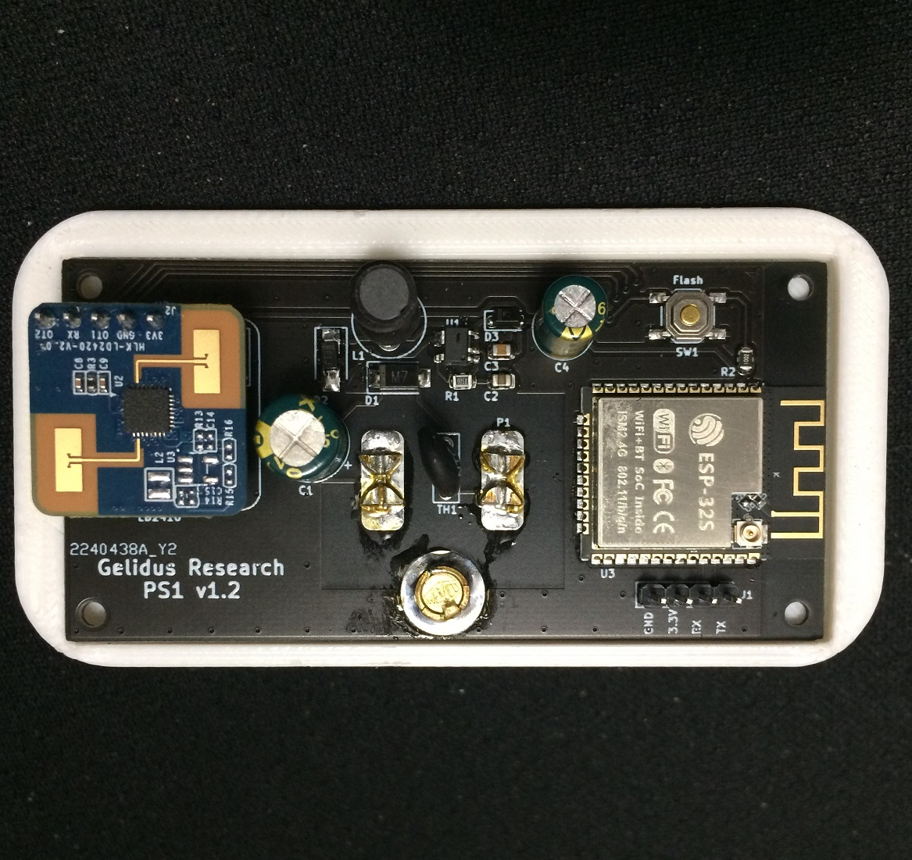

Gelidus Research PS1 Presence Sensor ESPHome component
=====================================================

The Gelidus Research PS1 mains powered human presence sensor integrates the new HLK-LD2420 24GHz mmWave radar module.



Operation
=========
TODO


ESPHome Configuration
=====================

TODO

Notes
=====

This module is very new and Hi-Link has changed several items in the process of this development.
Depending on the firmware you have the baudrate will be 256000 for any module with less than firmware v1.5.3
Also the tx_pin was moved from ot2 to ot1 with firmware v1.5.3 
There are known errors in the serial protocol document released by Hi-Link, no updates are available at this time.
This component is fully functional and ready for field test drives.
Thanks for your interest!   

```
external_components:
  # pull geiger from Github @descipher branch in GitHub
  - source: github://GelidusResearch/grps@current
    components: [ ld2420 ]
    refresh: 0s

esphome:
  name: presence-1
  friendly_name: presence-1

esp32:
  board: esp32dev
  framework:
    type: arduino

# Enable logging
logger:

# Enable Home Assistant API
api:
  encryption:
    key: "<your.api.key>"

ota:
  password: "<your.ota.password>"

wifi:
  ssid: !secret wifi_ssid
  password: !secret wifi_password

  # Enable fallback hotspot (captive portal) in case wifi connection fails
 ap:
    ssid: presense-1
    password: !secret captive_password

captive_portal:

web_server:
  port: 80

uart:
  id: ubus
  tx_pin: GPIO16
  rx_pin: GPIO17
  baud_rate: 115200
  parity: NONE
  stop_bits: 1

# The LD2420 has 16 sense gates 0-15, 0.75m of resolution, max distance is spec'd at 8m
ld2420:
  presence_time_window: 120s
  detection_gate_minimum : 1
  detection_gate_maximum: 15
  g0_move_threshold: 60000
  g0_still_threshold: 40000
  g1_move_threshold: 40000
  g1_still_threshold: 20000
  g2_move_threshold: 8000
  g2_still_threshold: 1000
  g3_move_threshold: 800
  g3_still_threshold: 400
  g4_move_threshold: 800
  g4_still_threshold: 400
  g5_move_threshold: 500
  g5_still_threshold: 300
  g6_move_threshold: 500
  g6_still_threshold: 300
  g7_move_threshold: 500
  g7_still_threshold: 300
  g8_move_threshold: 400
  g8_still_threshold: 200
  g9_move_threshold: 400
  g9_still_threshold: 200
  g10_move_threshold: 400
  g10_still_threshold: 200
  g11_move_threshold: 400
  g11_still_threshold: 200
  g12_move_threshold: 300
  g12_still_threshold: 100
  g13_move_threshold: 300
  g13_still_threshold: 100
  g14_move_threshold: 200
  g14_still_threshold: 100
  g15_move_threshold: 200
  g15_still_threshold: 100

sensor:
  - platform: ld2420
    moving_distance:
      name : Moving Distance

binary_sensor:
  - platform: ld2420
    has_target:
      name: Presence

switch:
  - platform: restart
    name: Restart    
```


